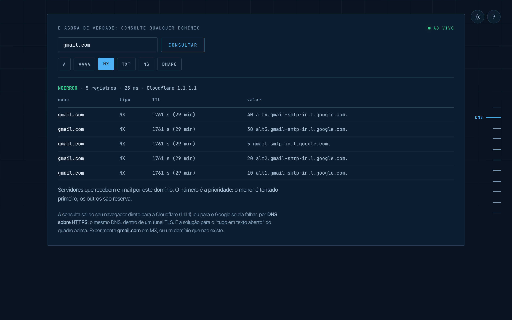
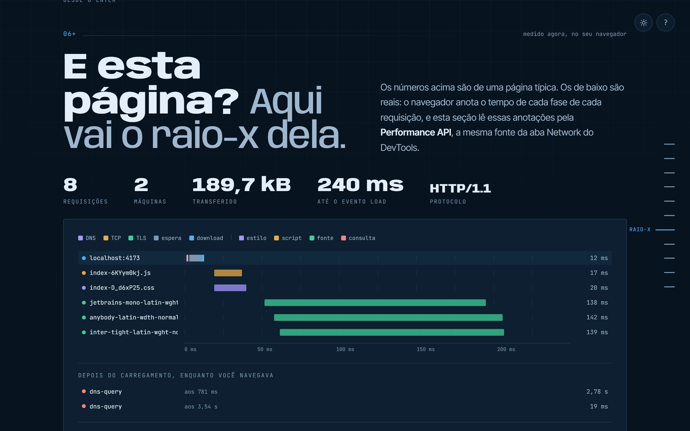
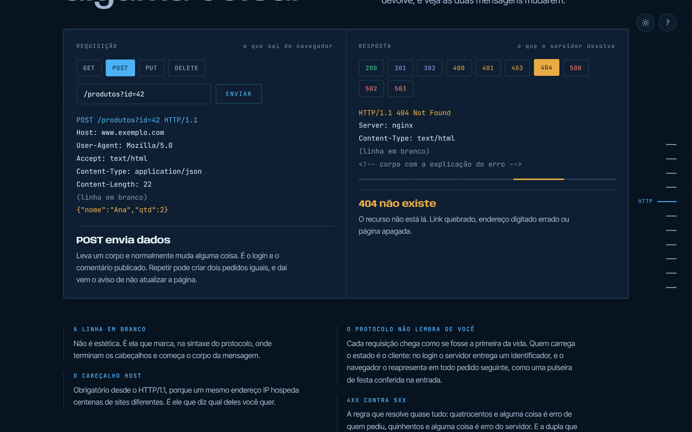
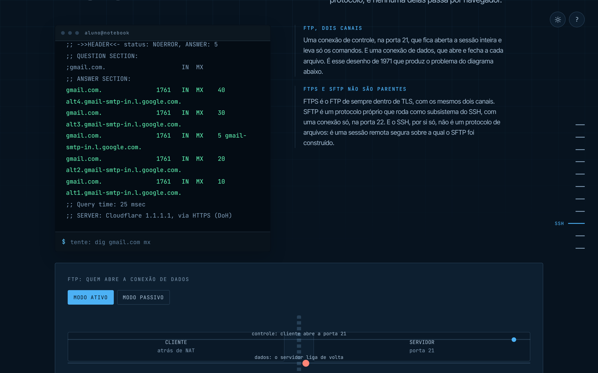

<div align="center">

# Entre o Enter e a página

**O que acontece nos 300 milissegundos entre apertar Enter e a página aparecer?**
Uma travessia interativa pela camada de aplicação, com consultas DNS reais e o raio-x da própria página.

[**Ver ao vivo →**](https://erickysilva.github.io/redes-na-pratica/)


</div>

## Sobre

Uma página que percorre, em dez etapas, tudo o que a rede faz depois do Enter: a URL é
dissecada, o DNS resolve o nome, o TCP abre a conexão, o TLS fecha o túnel, o HTTP faz o
pedido e o navegador monta a página. Depois, a viagem sai do navegador para SSH, FTP e
e-mail (SMTP, POP3 e IMAP).

Ela nasceu como material de apoio para a minha apresentação sobre **a camada de aplicação**
na disciplina de Redes de Computadores. A pesquisa, o roteiro e os slides são meus. A ideia
aqui é o conteúdo ser explorado, não só lido: quase todo conceito tem algo para clicar,
digitar ou ver acontecer.

## O que tem de especial

### A rede de verdade, não uma simulação

- **DNS real.** O domínio que você digitar é resolvido de verdade, pelo navegador, via
  [DNS sobre HTTPS](https://datatracker.ietf.org/doc/html/rfc8484) (Cloudflare, com o
  Google como reserva). O IP real passa a aparecer na página inteira.
- **Explorador DNS.** Consulta registros A, AAAA, MX, TXT, NS e a política DMARC de
  qualquer domínio, marca registros SPF e explica respostas NXDOMAIN mostrando quem
  garantiu que o nome não existe.
- **Terminal com `dig` e `nslookup` reais**, com histórico (↑ ↓) e autocompletar (Tab).
- **Raio-X desta página.** Uma cascata no estilo da aba Network do DevTools, montada com
  a [Performance API](https://developer.mozilla.org/pt-BR/docs/Web/API/Performance_API):
  DNS, TCP, TLS, espera e download medidos no seu navegador, no momento em que você abre
  a página.

|                                   Explorador DNS ao vivo                                   |                        Raio-X da página                        |
| :----------------------------------------------------------------------------------------: | :------------------------------------------------------------: |
|  |  |

|                       Playground HTTP                        |                         Terminal com dig real                          |
| :----------------------------------------------------------: | :--------------------------------------------------------------------: |
|  |  |

### Interatividade em todas as etapas

URL clicável, cadeia DNS guiada pela rolagem, aperto de mão TCP com perda de pacote,
túnel TLS com certificado inválido, playground HTTP com métodos e códigos de status,
acordeão das camadas do TCP/IP, FTP ativo × passivo com firewall, Telnet × SSH lado a
lado, POP3 × IMAP em três aparelhos e um quiz no final.

### Modo apresentação

As setas **← →** pulam de etapa em etapa, e a página vira um controle remoto para
apresentar o conteúdo em sala. **T** alterna o tema e **?** mostra todos os atalhos.

## Engenharia

|                      |                                                                                                                                                                                               |
| -------------------- | --------------------------------------------------------------------------------------------------------------------------------------------------------------------------------------------- |
| **Sem framework**    | HTML semântico, CSS com design tokens e JavaScript em módulos ES. Build com [Vite](https://vite.dev).                                                                                         |
| **HTML em parciais** | Um arquivo por seção, composto por um [plugin Vite próprio](plugins/html-partials.js) com inclusão aninhada e detecção de ciclos.                                                             |
| **Lógica isolada**   | Regras puras em [`src/js/lib`](src/js/lib) (cliente DoH, Performance API, normalização de URL), testadas sem DOM e sem rede.                                                                  |
| **Acessibilidade**   | WCAG 2.1 AA verificado com [axe-core](https://github.com/dequelabs/axe-core) nos dois temas. Abas navegáveis por teclado, foco gerenciado, `aria-live` e respeito a `prefers-reduced-motion`. |
| **Performance**      | Fontes hospedadas no próprio site (nenhuma requisição a terceiros), `content-visibility` nas etapas fora da tela e um único `requestAnimationFrame` para todas as cenas.                      |
| **Tema escuro**      | Segue o sistema, lembra a escolha e é aplicado antes da primeira pintura, sem piscar.                                                                                                         |
| **Resiliência**      | Sem internet, a página continua funcionando com os valores de exemplo, e cada seção inicializa isolada das outras.                                                                            |

### Testes

- **76 testes unitários** com [Vitest](https://vitest.dev): cliente DNS (com _fallback_
  entre resolvedores e tempo limite), cálculo da cascata de rede, validação de domínios,
  o plugin de parciais e a integridade do conteúdo.
- **28 testes de ponta a ponta** com [Playwright](https://playwright.dev), no desktop e
  no celular, cobrindo todas as etapas, o tema, os atalhos e a auditoria de
  acessibilidade. As chamadas DNS são interceptadas, e os testes não dependem da internet.
- **CI no GitHub Actions**: formatação, lint e as duas suítes rodam a cada push. O deploy
  no GitHub Pages só acontece se tudo passar.

### Lighthouse

Mediana de cinco execuções, build de produção.

|         | Performance | Acessibilidade | Boas práticas | SEO |
| ------- | :---------: | :------------: | :-----------: | :-: |
| Desktop |     100     |      100       |      100      | 100 |
| Celular |     97      |      100       |      100      | 100 |

## Rodando localmente

Requer [Node.js](https://nodejs.org) 20.19 ou superior.

```bash
npm install
npm run dev          # servidor de desenvolvimento
```

| Comando                           | O que faz                                                                        |
| --------------------------------- | -------------------------------------------------------------------------------- |
| `npm run build`                   | gera a versão de produção em `dist/`                                             |
| `npm run preview`                 | serve o `dist/` localmente                                                       |
| `npm test`                        | testes unitários                                                                 |
| `npm run test:e2e`                | testes de ponta a ponta (na primeira vez: `npx playwright install chromium`)     |
| `npm run test:all`                | lint, testes unitários e de ponta a ponta                                        |
| `npm run lint` · `npm run format` | ESLint e Prettier                                                                |
| `npm run screenshots`             | regenera as imagens deste README e a de compartilhamento (com o preview rodando) |

## Estrutura

```
├── index.html               # esqueleto: <head> e a ordem das seções
├── plugins/html-partials.js # composição do HTML em tempo de build
├── src/
│   ├── partials/            # HTML: layout, componentes e uma seção por arquivo
│   ├── styles/              # CSS: tokens, base, layout, componentes e uma seção por arquivo
│   └── js/
│       ├── core/            # estado, rolagem, tema, teclado, serviço de DNS
│       ├── lib/             # lógica pura e testável (DoH, timing, URL, texto)
│       ├── data/            # conteúdo: textos do HTTP, quiz, e-mail, terminal
│       └── sections/        # comportamento de cada seção
├── tests/
│   ├── unit/                # Vitest
│   └── e2e/                 # Playwright + axe
└── .github/workflows/ci.yml # qualidade → testes → build → deploy
```

## Publicação

O build usa caminhos relativos, então funciona em qualquer hospedagem estática. No GitHub
Pages, basta ativar _Settings → Pages → Source: GitHub Actions_. O endereço público usado
nas meta tags de compartilhamento fica em [`.env`](.env) (`VITE_SITE_URL`).

## Referências

- Kurose, J.; Ross, K. _Redes de Computadores e a Internet_. Pearson.
- Tanenbaum, A.; Wetherall, D.; Feamster, N. _Redes de Computadores_. Pearson.
- Comer, D. _Interligação de Redes com TCP/IP_. Elsevier.
- RFCs 1034/1035 (DNS), 8484 (DNS sobre HTTPS), 9110–9114 (HTTP), 8446 (TLS 1.3),
  3986 (URI), 959 (FTP), 4251–4254 (SSH), 5321 (SMTP), 1939 (POP3), 9051 (IMAP).

---

<div align="center">

Feito por **Ericky Silva** · [Licença MIT](LICENSE)

</div>
